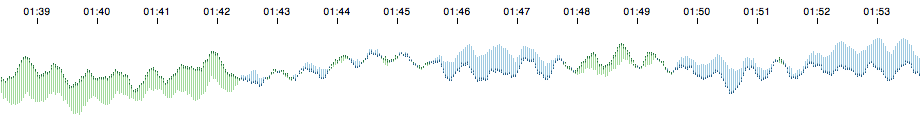

> [Wiki](Home) ▸ [API Reference](API-Reference) ▸ <b>Comparison</b>



A <b>comparison chart</b>, showing a primary metric in the context of a secondary metric. To create a comparison chart, first create a [context](Context). For example:

```js
var context = cubism.context(), // a default context
    comparison = context.comparison(); // a default comparison chart
```

Next you'll need at least two metrics to visualize, which typically requires one or more source, such as [Graphite](Graphite) or [Cube](Cube):

```js
var cube = context.cube("http://cube.example.com"),
    primary = cube.metric("sum(request)"),
    secondary = primary.shift(-7 * 24 * 60 * 60 * 1000);
```

<a name="_comparison" href="#wiki-_comparison">#</a> <b>comparison</b>(<i>selection</i>)

Apply the comparison chart to a [D3 selection](/mbostock/d3/wiki/Selections). The default primary and secondary metrics accessor assume that each element's data is a two-element array of metrics. Thus, by binding a two-dimensional array of metrics to a selection, you can create one or more comparison charts:

```js
d3.select("body").selectAll(".comparison")
    .data([[primary, secondary]])
  .enter().append("div")
    .attr("class", "comparison")
    .call(comparison);
```

<a name="height" href="#wiki-height">#</a> comparison.<b>height</b>([<i>height</i>])

Get or set the chart height in pixels. If <i>height</i> is specified, sets the chart height to the specified value in <i>pixels</i> and returns the comparison chart. If <i>height</i> is not specified, returns the current height, which defaults to 120 pixels.

<a name="primary" href="#wiki-primary">#</a> comparison.<b>primary</b>([<i>metric</i>])

Get or set the primary chart metric. If <i>metric</i> is specified, sets the primary metric accessor and returns the chart. The <i>metric</i> may be specified either as a single [metric](Metric), or as a function that returns a metric. If <i>metric</i> is not specified, returns the current primary metric accessor, which defaults to `function(d) { return d[0]; }` (so that you can bind the selection to a two-dimensional array of metrics, as demonstrated above). When the metric is specified as an accessor function, it is invoked for each element in the selection, being passed the bound data (`d`) and index (`i`).

<a name="secondary" href="#wiki-secondary">#</a> comparison.<b>secondary</b>([<i>metric</i>])

Get or set the secondary chart metric. If <i>metric</i> is specified, sets the secondary metric accessor and returns the chart. The <i>metric</i> may be specified either as a single [metric](Metric), or as a function that returns a metric. If <i>metric</i> is not specified, returns the current secondary metric accessor, which defaults to `function(d) { return d[1]; }` (so that you can bind the selection to a two-dimensional array of metrics, as demonstrated above). When the metric is specified as an accessor function, it is invoked for each element in the selection, being passed the bound data (`d`) and index (`i`).

<a name="scale" href="#wiki-scale">#</a> comparison.<b>scale</b>([<i>scale</i>])

Get or set the chart <i>y</i>-scale. If <i>scale</i> is specified, sets the chart <i>y</i>-scale to the specified value and returns the chart. If <i>scale</i> is not specified, returns the current <i>y</i>-scale which defaults to a [linear scale](/mbostock/d3/wiki/Quantitative-Scales#wiki-linear) with [rounding](/mbostock/d3/wiki/Quantitative-Scales#wiki-linear_rangeRound). For example, this method can be used to apply a [square-root](/mbostock/d3/wiki/Quantitative-Scales#wiki-sqrt) transform.

<a name="extent" href="#wiki-extent">#</a> comparison.<b>extent</b>([<i>extent</i>])

Get or set the chart extent (if not automatic). If <i>extent</i> is specified, sets the chart extent accessor and returns the chart. The <i>extent</i> may be specified either as an array of two numbers, or as a function that returns such an array. If <i>extent</i> is not specified, returns the current extent accessor, which defaults to null. When the extent is specified as an accessor function, it is invoked for each element in the selection, being passed the bound data (`d`) and index (`i`). If the extent is null, it will be computed automatically via [metric.extent](Metric#wiki-extent) for the primary metric.

<a name="title" href="#wiki-title">#</a> comparison.<b>title</b>([<i>title</i>])

Get or set the chart title. If <i>title</i> is specified, sets the chart title accessor and returns the chart. The <i>title</i> may be specified either as a string, or as a function that returns a string. If <i>title</i> is not specified, returns the current title accessor, which defaults to the identity function. When the title is specified as an accessor function, it is invoked for each element in the selection, being passed the bound data (`d`) and index (`i`). If the title is null, no title will be displayed.

<a name="formatPrimary" href="#wiki-formatPrimary">#</a> comparison.<b>formatPrimary</b>([<i>format</i>])

Get or set the chart's primary value format function. If <i>format</i> is specified, sets the chart primary value formatter and returns the chart. If <i>format</i> is not specified, returns the current formatter, which defaults to `d3.format(".2s")`; see [d3.format](/mbostock/d3/wiki/Formatting#wiki-d3_format) for details.

<a name="formatChange" href="#wiki-formatChange">#</a> comparison.<b>formatChange</b>([<i>format</i>])

Get or set the chart's change format function. If <i>format</i> is specified, sets the chart change formatter and returns the chart. If <i>format</i> is not specified, returns the current change formatter, which defaults to `d3.format("+.0%")`; see [d3.format](/mbostock/d3/wiki/Formatting#wiki-d3_format) for details. The change formatter is passed (<i>primaryValue</i> - <i>secondaryValue</i>) / <i>secondaryValue</i> and is typically used to display percentage change.

<a name="colors" href="#wiki-colors">#</a> comparison.<b>colors</b>([<i>colors</i>])

Get or set the comparison colors. If <i>colors</i> is specified, sets the negative and positive colors to the specified four-element array of <i>colors</i> and returns the chart. If <i>colors</i> is not specified, returns the current four-element array of colors, which defaults to <font color="#9ecae1">#9ecae1</font> <font color="#225b84">#225b84</font> <font color="#a1d99b">#a1d99b</font> <font color="#22723a">#22723a</font>. These colors are designed for a light background. For colors against a dark background, try <font color="#3182bd">#3182bd</font> <font color="#add8e6">#add8e6</font> <font color="#31a354">#31a354</font> <font color="#90ee90">#90ee90</font>.

<a name="strokeWidth" href="#wiki-strokeWidth">#</a> comparison.<b>strokeWidth</b>([<i>width</i>])

Get or set the primary metric stroke width, in pixels. If <i>width</i> is specified, sets the stroke width in pixels and returns the chart. If <i>width</i> is not specified, returns the current stroke width, which defaults to 1.5 pixels.

<a name="remove" href="#wiki-remove">#</a> comparison.<b>remove</b>(<i>selection</i>)

Removes the comparison chart from a [D3 selection](/mbostock/d3/wiki/Selections), and removes any of the chart's associated listeners. This method only removes the contents added by the chart itself; typically, you also want to call [remove](/mbostock/d3/wiki/Selections#wiki-remove) on the selection. For example:

```js
d3.select(".comparison")
    .call(comparison.remove)
    .remove();
```

Requires that the elements in the selection were previously bound to this chart.