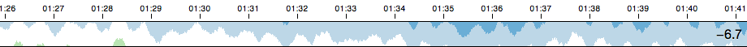

> [Wiki](Home) ▸ [API Reference](API-Reference) ▸ <b>Horizon</b>



A <b>horizon chart</b>. To create a [horizon chart](http://vis.berkeley.edu/papers/horizon/), first create a [context](Context). For example:

```js
var context = cubism.context(), // a default context
    horizon = context.horizon(); // a default horizon chart
```

Next you'll need an array of metrics to visualize, which typically requires one or more source, such as [Graphite](Graphite) or [Cube](Cube):

```js
var cube = context.cube("http://cube.example.com");

var metrics = [
  cube.metric("sum(request.eq(language,'en'))"),
  cube.metric("sum(request.eq(language,'es'))"),
  cube.metric("sum(request.eq(language,'de'))"),
  cube.metric("sum(request.eq(language,'fr'))")
];
```

Equivalently, you could use `cube.metric` as the [metric accessor](#wiki-metric), and simplify the definition of the metrics as an array of strings:

```js
var horizon = context.horizon()
    .metric(cube.metric);

var metrics = [
 "sum(request.eq(language,'en'))",
 "sum(request.eq(language,'es'))",
 "sum(request.eq(language,'de'))",
 "sum(request.eq(language,'fr'))"
];
```

Or you could go one step further and use an array of languages:

```js
var horizon = context.horizon()
    .metric(function(d) { return cube.metric("sum(request.eq(language,'" + d + "'))"); });

var metrics = [
 "en",
 "es",
 "de",
 "fr"
];
```

<a name="_horizon" href="#wiki-_horizon">#</a> <b>horizon</b>(<i>selection</i>)

Apply the horizon chart to a [D3 selection](/mbostock/d3/wiki/Selections). By binding the metrics to a selection, you can create a horizon chart per metric:

```js
d3.select("body").selectAll(".horizon")
    .data(metrics)
  .enter().append("div")
    .attr("class", "horizon")
    .call(horizon);
```

<a name="mode" href="#wiki-mode">#</a> horizon.<b>mode</b>([<i>mode</i>])

Get or set the horizon mode, which controls how negative values are displayed. If <i>mode</i> is specified, sets the mode and returns the horizon chart. If <i>mode</i> is not specified, returns the current mode. Defaults to "offset". The following modes are supported, as illustrated in this diagram:


* <b>offset</b> mode translates negative values up, so they descend from the top edge of the chart.

* <b>mirror</b> mode inverts negative values, equivalent to taking the absolute value.

<a name="height" href="#wiki-height">#</a> horizon.<b>height</b>([<i>pixels</i>])

Get or set the chart height in pixels. If <i>height</i> is specified, sets the chart height to the specified value in <i>pixels</i> and returns the horizon chart. If <i>height</i> is not specified, returns the current height, which defaults to 30 pixels.

<a name="metric" href="#wiki-metric">#</a> horizon.<b>metric</b>([<i>metric</i>])

Get or set the chart metric accessor. If <i>metric</i> is specified, sets the chart metric accessor and returns the horizon chart. The <i>metric</i> may be specified either as a single [metric](Metric), or as a function that returns a metric. If <i>metric</i> is not specified, returns the current metric accessor, which defaults to the identity function (so that you can bind the selection to an array of metrics, as demonstrated above). When the metric is specified as an accessor function, it is invoked for each element in the selection, being passed the bound data (`d`) and index (`i`).

<a name="scale" href="#wiki-scale">#</a> horizon.<b>scale</b>([<i>scale</i>])

Get or set the chart <i>y</i>-scale. If <i>scale</i> is specified, sets the chart <i>y</i>-scale to the specified value and returns the chart. If <i>scale</i> is not specified, returns the current <i>y</i>-scale which defaults to a [linear scale](/mbostock/d3/wiki/Quantitative-Scales#wiki-linear) with [rounding](/mbostock/d3/wiki/Quantitative-Scales#wiki-linear_rangeRound). For example, this method can be used to apply a [square-root](/mbostock/d3/wiki/Quantitative-Scales#wiki-sqrt) transform.

<a name="extent" href="#wiki-extent">#</a> horizon.<b>extent</b>([<i>extent</i>])

Get or set the chart extent (if not automatic). If <i>extent</i> is specified, sets the chart extent accessor and returns the horizon chart. The <i>extent</i> may be specified either as an array of two numbers, or as a function that returns such an array. If <i>extent</i> is not specified, returns the current extent accessor, which defaults to null. When the extent is specified as an accessor function, it is invoked for each element in the selection, being passed the bound data (`d`) and index (`i`). If the extent is null, it will be computed automatically via [metric.extent](Metric#wiki-extent).

<a name="title" href="#wiki-title">#</a> horizon.<b>title</b>([<i>title</i>])

Get or set the chart title. If <i>title</i> is specified, sets the chart title accessor and returns the horizon chart. The <i>title</i> may be specified either as a string, or as a function that returns a string. If <i>title</i> is not specified, returns the current title accessor, which defaults to the identity function. When the title is specified as an accessor function, it is invoked for each element in the selection, being passed the bound data (`d`) and index (`i`). If the title is null, no title will be displayed.

<a name="format" href="#wiki-format">#</a> horizon.<b>format</b>([<i>format</i>])

Get or set the chart's value format function. If <i>format</i> is specified, sets the chart value formatter and returns the horizon chart. If <i>format</i> is not specified, returns the current formatter, which defaults to `d3.format(".2s")`; see [d3.format](/mbostock/d3/wiki/Formatting#wiki-d3_format) for details.

<a name="colors" href="#wiki-colors">#</a> horizon.<b>colors</b>([<i>colors</i>])

Get or set the horizon layer colors. If <i>colors</i> is specified, sets the horizon layer colors to the specified array of <i>colors</i> and returns the horizon chart. If <i>colors</i> is not specified, returns the current array of colors, which defaults to <font color="#08519c">#08519c</font> <font color="#3182bd">#3182bd</font> <font color="#6baed6">#6baed6</font> <font color="#bdd7e7">#bdd7e7</font> <font color="#bae4b3">#bae4b3</font> <font color="#74c476">#74c476</font> <font color="#31a354">#31a354</font> <font color="#006d2c">#006d2c</font>. The array of colors must have an even number of elements; <i>color.length / 2</i> determines the number of bands. The first half of the array lists the colors used for the negative bands, and the second half lists the colors for the positive bands.

<a name="remove" href="#wiki-remove">#</a> horizon.<b>remove</b>(<i>selection</i>)

Removes the horizon chart from a [D3 selection](/mbostock/d3/wiki/Selections), and removes any of the chart's associated listeners. This method only removes the contents added by the horizon chart itself; typically, you also want to call [remove](/mbostock/d3/wiki/Selections#wiki-remove) on the selection. For example:

```js
d3.select(".horizon")
    .call(horizon.remove)
    .remove();
```

Requires that the elements in the selection were previously bound to this chart.